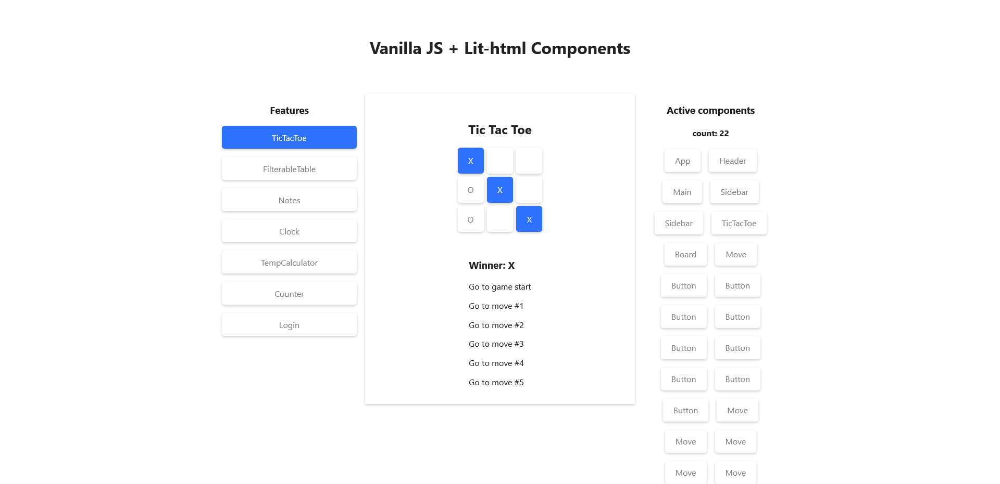

# vanilla-js-lithtml-components

## Table of contents

- [Overview](#overview)
  - [Screenshot](#screenshot)
  - [Features](#features)
  - [Links](#links)
- [My process](#my-process)
  - [Built with](#built-with)
  - [What I learned](#what-i-learned)
  - [Continued development](#continued-development)
  - [Useful resources](#useful-resources)
- [Author](#author)

## Overview

### Screenshot

### Links

- [Live Site Demo](https://vanilla-js-lit-html-components.netlify.app/)
- [Code Repository](https://github.com/MariusHor/vanilla-js-lithtml-components)

### Features

## My process

### Built with

- mobile-first workflow
- semantic HTML5 markup
- scss
- javaScript
- lit-html
- webpack

### What I learned

### Continued development

### Useful resources

## Author

- Github - [@MariusHor](https://github.com/MariusHor/)
- Frontend Mentor - [@MariusHor](https://www.frontendmentor.io/profile/MariusHor)
